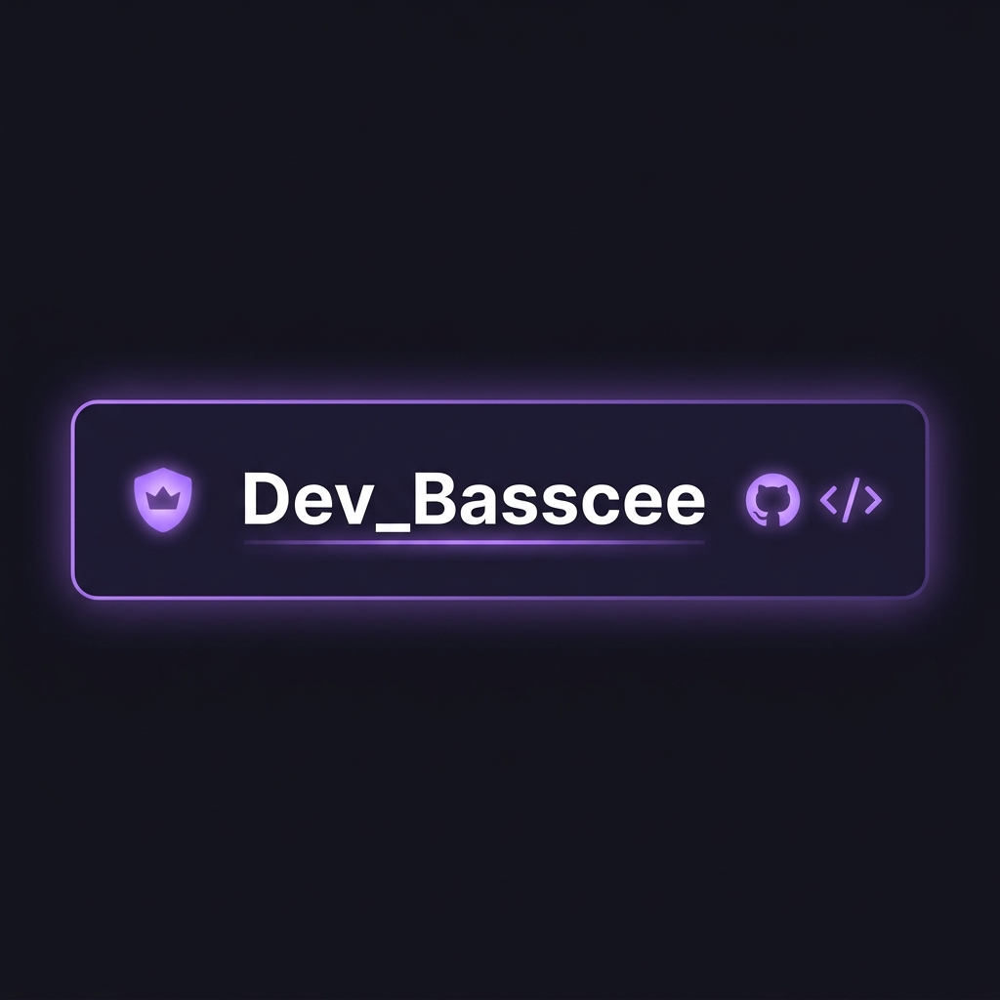

<div align="center">


<br/>

[](https://www.typescriptlang.org/)
[](https://web.dev/progressive-web-apps/)
[](https://mozilla.github.io/pdf.js/)
[](LICENSE)
[]()

<br/>

> **Upload your course PDFs → Read page by page → Listen with live amber highlighting.**  
> A free, open-source alternative to Speechify — runs entirely in your browser.

<br/>

[🚀 Quick Start](#-quick-start) · [✨ Features](#-features) · [📸 Screenshots](#-screenshots) · [🛠️ Tech Stack](#-tech-stack) · [📲 Install as App](#-install-as-pwa)

</div>

---

## ✨ Features

<table>
<tr>
<td width="50%">

### 📖 Reader
- **Page-by-Page PDF rendering** — full visual fidelity, fonts & images intact
- **Live amber highlighting** — tracks every line as TTS reads
- **Click any line** to jump reading position instantly
- **Auto-advance** — flips to the next page automatically
- **Page thumbnails** — visual sidebar navigation

</td>
<td width="50%">

### 🎙️ TTS Engine
- **Smart preprocessing** — ALL-CAPS words read as words, not letters
- **Abbreviation expansion** — `Dr.` → *Doctor*, `etc.` → *etcetera*
- **Unit reading** — `5kg` → *5 kilograms*, `32°C` → *32 degrees Celsius*
- **Symbol handling** — `&` → *and*, `%` → *percent*
- **Punctuation awareness** — natural pauses at commas, dashes, ellipsis

</td>
</tr>
<tr>
<td>

### 📱 Mobile
- **PWA installable** — add to home screen on Android & iOS
- **Portrait optimised** — auto-fits PDF to screen width
- **Swipe navigation** — left/right to change pages
- **Touch-friendly** — large tap targets, no accidental misclicks
- **iOS safe area** — respects notch & home indicator

</td>
<td>

### 🎨 Design
- **Dark & Light mode** — preference saved across sessions
- **Glassmorphism UI** — premium frosted-glass aesthetic
- **Responsive** — Mobile · Tablet · Desktop breakpoints
- **Smooth animations** — sidebar drawer, highlights, toasts
- **Offline support** — Service Worker caches the app shell

</td>
</tr>
</table>

---

## 📸 Screenshots

<div align="center">

| Mobile — Welcome | Mobile — PDF + Sidebar | Mobile — Reading |
|:---:|:---:|:---:|
|  |  |  |

> *Replace placeholder images with actual screenshots after first run.*

</div>

---

## 🚀 Quick Start

### Prerequisites
- [Node.js](https://nodejs.org/) v18+
- [Git](https://git-scm.com/)
- Chrome or Edge browser (for best TTS support)

### Installation

```bash
# 1. Clone the repository
git clone https://github.com/Dev-Basscee/Text-toSpeech.git
cd Text-toSpeech

# 2. Install TypeScript (the only dependency)
npm install

# 3. Compile TypeScript source → app.js
npm run build

# 4. Serve locally
npx serve . -p 3131
```

Then open **[http://localhost:3131](http://localhost:3131)** in Chrome or Edge.

### Development (watch mode)

```bash
# Auto-recompile on every save to src/app.ts
npm run dev
```

---

## 🛠️ Tech Stack

| Technology | Role | Why |
|---|---|---|
| **TypeScript 5.4** | Application logic | Type safety, better DX |
| **PDF.js 3.11** | PDF rendering | Mozilla's battle-tested engine |
| **Web Speech API** | Text-to-speech | Built into the browser — no API key needed |
| **Service Worker** | Offline + caching | PWA installability |
| **Vanilla CSS** | Styling | Zero runtime overhead, full control |
| **HTML5** | Structure | Semantic, accessible markup |

---

## 📁 Project Structure

```
Text-toSpeech/
│
├── 📄 index.html          # App shell — all UI components
├── 🎨 style.css           # Mobile-first responsive design system
├── ⚙️  app.js              # Compiled output (TypeScript → JS)
├── 🔧 sw.js               # Service Worker (offline support)
├── 📋 manifest.json       # PWA Web App Manifest
│
├── 📂 src/
│   └── app.ts             # TypeScript source (the real code)
│
├── 📂 icons/
│   ├── icon-192.png       # PWA icon (small)
│   ├── icon-512.png       # PWA icon (large)
│   ├── icon-maskable.png  # Android adaptive icon
│   └── apple-touch-icon.png  # iOS home screen icon
│
├── 📂 docs/
│   ├── banner.png         # README hero image
│   └── author.png         # Author card
│
├── 📝 tsconfig.json       # TypeScript compiler config
├── 📦 package.json        # npm scripts
└── 🚫 .gitignore
```

---

## 📲 Install as PWA

<table>
<tr>
<td align="center" width="33%">

### 🤖 Android
Visit the URL in **Chrome** → tap the **"Install LexaRead"** banner at the bottom → confirm → it appears on your home screen like a native app

</td>
<td align="center" width="33%">

### 🍎 iOS Safari
Visit the URL → tap the **Share** button → **"Add to Home Screen"** → the app opens fullscreen with no browser chrome

</td>
<td align="center" width="33%">

### 🖥️ Desktop
Visit the URL in **Chrome or Edge** → click the **⊕ install icon** in the address bar → installs as a standalone desktop app

</td>
</tr>
</table>

---

## ⌨️ Keyboard Shortcuts

| Key | Action |
|---|---|
| `Space` | Play / Pause TTS |
| `Shift + →` | Next page |
| `Shift + ←` | Previous page |
| `↑` | Speed up |
| `↓` | Slow down |
| Click any line | Jump reading to that position |

---

## 🧠 How the TTS Works

```
PDF Page
   │
   ▼
PDF.js getTextContent()          ← Extracts text items with screen positions
   │
   ▼
preprocessForTTS()               ← Cleans text for natural speech:
   │   • ALL-CAPS → lowercase    (NASA → nasa, PDF → pdf)
   │   • Abbreviations expanded  (Dr. → Doctor)
   │   • Symbols → words         (& → and, % → percent)
   │   • Units expanded          (5kg → 5 kilograms)
   │   • Punctuation normalised  (ensures pauses after . ! ?)
   ▼
SpeechSynthesisUtterance         ← Web Speech API reads it aloud
   │
   ▼
onboundary (charIndex)           ← Fires on each word boundary
   │
   ▼
Binary search → TextItem         ← Maps char position to screen div
   │
   ▼
div.classList.add('hl-active')   ← Amber highlight appears over PDF canvas
```

---

## 🤝 Contributing

Pull requests are welcome!

```bash
# Fork the repo, then:
git checkout -b feature/your-feature
# Make your changes to src/app.ts
npm run build
git commit -m "feat: your feature description"
git push origin feature/your-feature
# Open a Pull Request
```

---

## 📄 License

```
MIT License — Copyright (c) 2026 Dev_Basscee

Permission is hereby granted, free of charge, to any person obtaining a copy
of this software to use, copy, modify, merge, publish, distribute, sublicense,
and/or sell copies of the Software.
```

---

<div align="center">

<br/>



<br/>

**Built with 💜 by Dev_Basscee**

[](https://github.com/Dev-Basscee)
[](mailto:basscee1604@gmail.com)

<br/>

*If this project helped you, give it a ⭐ — it means a lot!*

<br/>

---

*LexaRead — Making learning accessible, one page at a time.*

</div>
